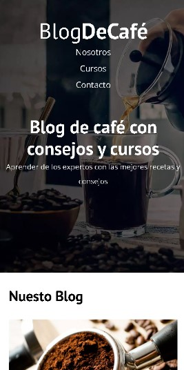
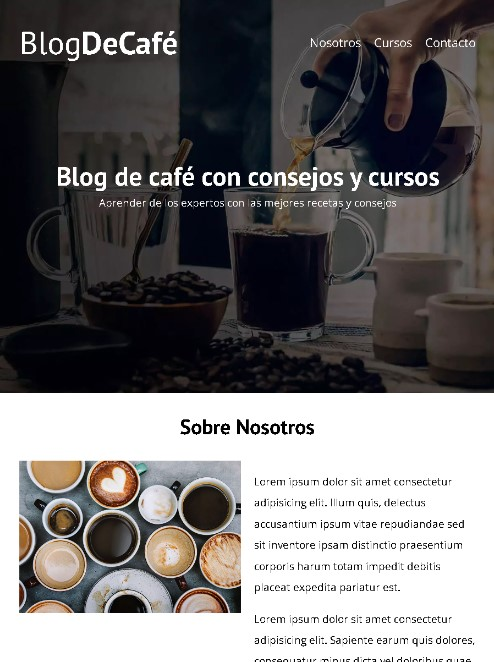
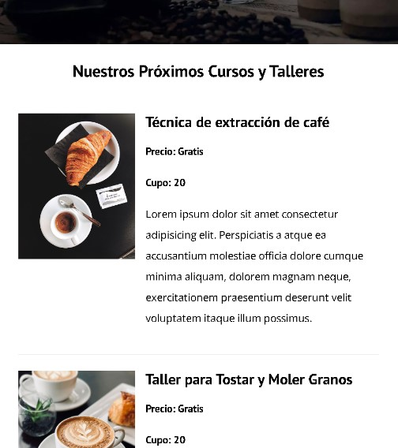
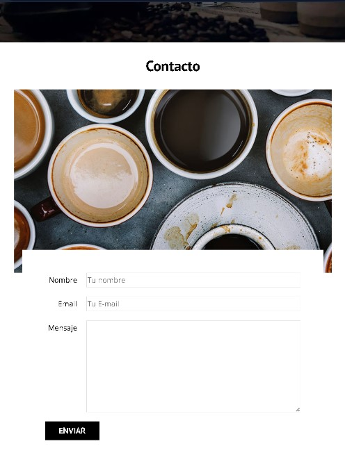
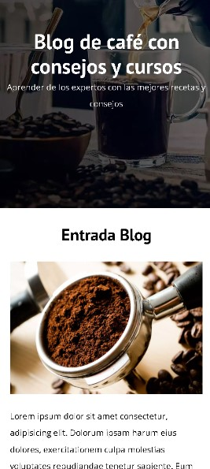

# Web Coffee Blog

## Introduction
This is a practice project to improve my skills in HTML and CSS. The goal is to create a coffee blog where you can read about us, find and read about new courses or workshops, and contact us through a form; all of this is about coffee.

## Screenshots

<p align="center">
    <picture>
        <source srcset="img/screenshots/screenshot1.webp" type="image/webp">
        
    </picture>
    <picture>
        <source srcset="img/screenshots/screenshot2.webp" type="image/webp">
        
    </picture>
    <picture>
        <source srcset="img/screenshots/screenshot3.webp" type="image/webp">
        
    </picture>
    <picture>
        <source srcset="img/screenshots/screenshot4.webp" type="image/webp">
        
    </picture>
    <picture>
        <source srcset="img/screenshots/screenshot5.webp" type="image/webp">
        
    </picture>
    <picture>
        <source srcset="img/screenshots/screenshot6.webp" type="image/webp">
        
    </picture>
</p>


## Features
- Navigation bar with links to different sections.
- Hero content.
- Services offered with a short summary.
- About us page.
- Information on coffee-related courses and workshops.
- footer with navegation bar with links to different sections.

## Technologies
  

## Installation

1. Clone this repository:
```bash
git clone https://github.com/FernandoMercado-Dev/web_CoffeeBlog-FrontEnd-ES.git
```
2. Navigate to the project folder
3. Open the index.html file