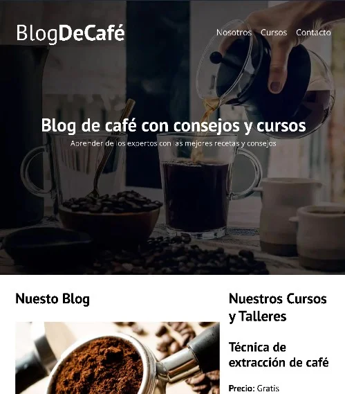
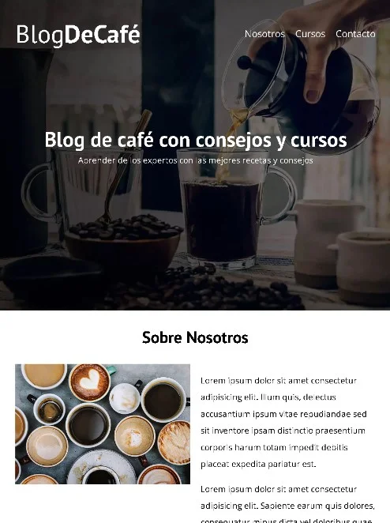

# Web Design and Development

## Introduction
This is a practice project to improve my skills in HTML and CSS. The goal is to create a simple webpage in Spanish.

## Screenshots
<p aling="center">
    
    
    
    
</p>


## Features
- Navigation bar with links to different sections
- Hero content
- Services offered with a short summary.
- About us page

## Technologies
 

## Installation

1. Clone this repository:
```bash
git clone https://github.com/FernandoMercado-Dev/web_CoffeeBlog-FrontEnd-ES.git
```
2. Navigate to the project folder
3. Open the index.html file